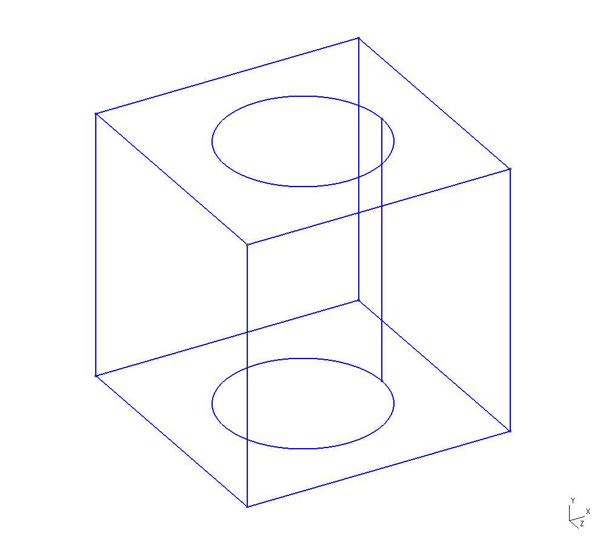
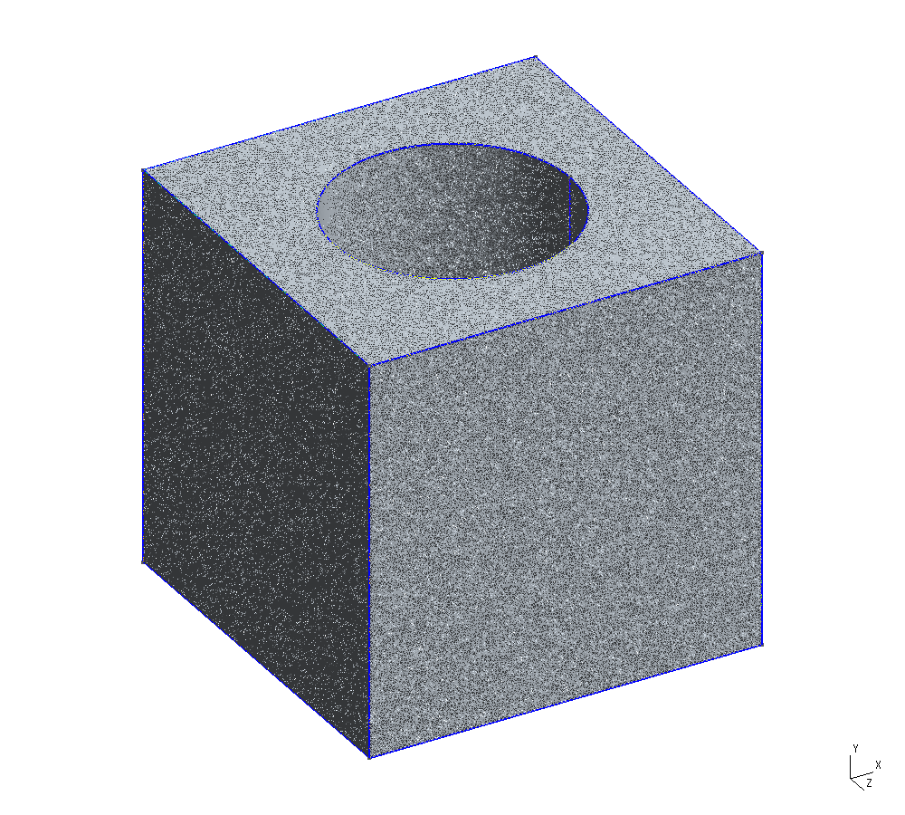
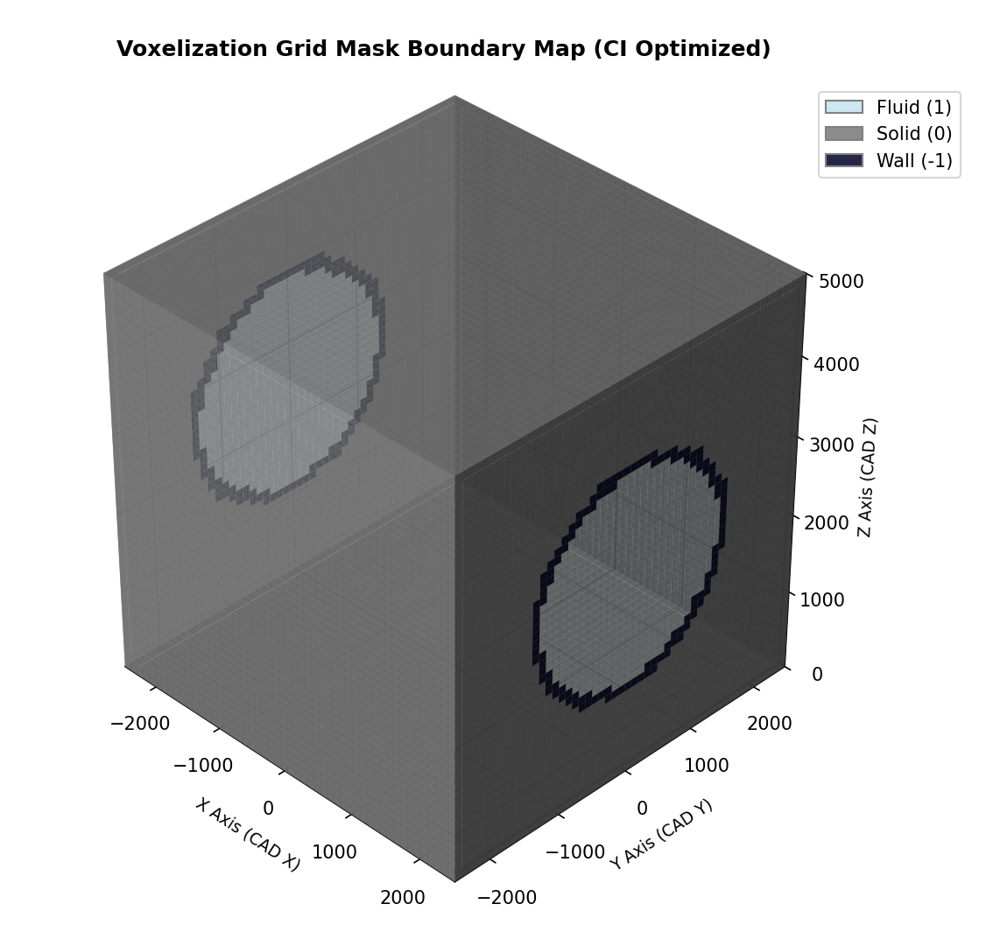

# 📐 Mesh Generator

## 🧩 CAD → Mesh → Voxelization Pipeline
A high‑fidelity scientific mesh generator designed for CAD/STEP geometries,
voxelization, CI‑optimized rendering, and simulation preprocessing.

### 🖼️ Pipeline Preview (STEP → Mesh → Voxel)

<table align="center" style="border: 1px solid white; border-collapse: collapse; background: transparent;">
  <tr>
    <td style="border: 1px solid white; text-align: center; vertical-align: middle; padding: 0 8px; background: transparent;">
      
    </td>
    <td style="border: 1px solid white; text-align: center; vertical-align: middle; padding: 0 12px; font-size: 32px; color: #666; background: transparent;">
      &rarr;
    </td>
    <td style="border: 1px solid white; text-align: center; vertical-align: middle; padding: 0 8px; background: transparent;">
      
    </td>
    <td style="border: 1px solid white; text-align: center; vertical-align: middle; padding: 0 12px; font-size: 32px; color: #666; background: transparent;">
      &rarr;
    </td>
    <td style="border: 1px solid white; text-align: center; vertical-align: middle; padding: 0 8px; background: transparent;">
      
    </td>
  </tr>
</table>

### 📚 Resources & Documentation
- **Tutorial/Book:** ***currently in development***

---

### 🧮 Performance Audit:
### Audit: 2026-07-30 15:19:52 UTC
- **Branch:** `main`
- **Status:** `success`
- **Run:** [Detailed Execution Logs](https://github.com/Dmitrii-Zavalin-Deployments/mesh_generator/actions/runs/30555894460)
- **CPU Load:** `22%`
- **Memory Usage:** `222/15988MB`
### Audit: 2026-07-30 14:58:23 UTC
- **Branch:** `main`
- **Status:** `success`
- **Run:** [Detailed Execution Logs](https://github.com/Dmitrii-Zavalin-Deployments/mesh_generator/actions/runs/30554174496)
- **CPU Load:** `26.2%`
- **Memory Usage:** `218/15989MB`
### Audit: 2026-07-30 14:50:23 UTC
- **Branch:** `main`
- **Status:** `success`
- **Run:** [Detailed Execution Logs](https://github.com/Dmitrii-Zavalin-Deployments/mesh_generator/actions/runs/30553501199)
- **CPU Load:** `28%`
- **Memory Usage:** `218/15989MB`
### Audit: 2026-07-30 14:44:59 UTC
- **Branch:** `main`
- **Status:** `success`
- **Run:** [Detailed Execution Logs](https://github.com/Dmitrii-Zavalin-Deployments/mesh_generator/actions/runs/30553009590)
- **CPU Load:** `24.4%`
- **Memory Usage:** `218/15988MB`
### Audit: 2026-07-30 14:30:58 UTC
- **Branch:** `main`
- **Status:** `failure`
- **Run:** [Detailed Execution Logs](https://github.com/Dmitrii-Zavalin-Deployments/mesh_generator/actions/runs/30551854446)
- **CPU Load:** `24.4%`
- **Memory Usage:** `225/15988MB`
### Audit: 2026-07-30 14:13:54 UTC
- **Branch:** `main`
- **Status:** `failure`
- **Run:** [Detailed Execution Logs](https://github.com/Dmitrii-Zavalin-Deployments/mesh_generator/actions/runs/30550509133)
- **CPU Load:** `4.6%`
- **Memory Usage:** `1166/15989MB`
### Audit: 2026-07-30 13:58:01 UTC
- **Branch:** `main`
- **Status:** `failure`
- **Run:** [Detailed Execution Logs](https://github.com/Dmitrii-Zavalin-Deployments/mesh_generator/actions/runs/30549224813)
- **CPU Load:** `0%`
- **Memory Usage:** `1164/15989MB`
### Audit: 2026-07-30 13:51:47 UTC
- **Branch:** `main`
- **Status:** `failure`
- **Run:** [Detailed Execution Logs](https://github.com/Dmitrii-Zavalin-Deployments/mesh_generator/actions/runs/30548680997)
- **CPU Load:** `0%`
- **Memory Usage:** `1176/15989MB`
### Audit: 2026-07-30 13:45:38 UTC
- **Branch:** `main`
- **Status:** `failure`
- **Run:** [Detailed Execution Logs](https://github.com/Dmitrii-Zavalin-Deployments/mesh_generator/actions/runs/30548231263)
- **CPU Load:** `0%`
- **Memory Usage:** `1302/15988MB`
### Audit: 2026-07-30 13:44:08 UTC
- **Branch:** `main`
- **Status:** `failure`
- **Run:** [Detailed Execution Logs](https://github.com/Dmitrii-Zavalin-Deployments/mesh_generator/actions/runs/30548109693)
- **CPU Load:** `2.4%`
- **Memory Usage:** `1214/15989MB`
### Audit: 2026-07-30 13:13:50 UTC
- **Branch:** `main`
- **Status:** `failure`
- **Run:** [Detailed Execution Logs](https://github.com/Dmitrii-Zavalin-Deployments/mesh_generator/actions/runs/30545807977)
- **CPU Load:** `0%`
- **Memory Usage:** `1410/15988MB`
### Audit: 2026-07-30 12:43:25 UTC
- **Branch:** `main`
- **Status:** `failure`
- **Run:** [Detailed Execution Logs](https://github.com/Dmitrii-Zavalin-Deployments/mesh_generator/actions/runs/30543611582)
- **CPU Load:** `2.4%`
- **Memory Usage:** `1237/15989MB`
### Audit: 2026-07-30 11:58:27 UTC
- **Branch:** `main`
- **Status:** `failure`
- **Run:** [Detailed Execution Logs](https://github.com/Dmitrii-Zavalin-Deployments/mesh_generator/actions/runs/30540485543)
- **CPU Load:** `0%`
- **Memory Usage:** `1286/15988MB`
### Audit: 2026-07-29 19:14:20 UTC
- **Branch:** `main`
- **Status:** `failure`
- **Run:** [Detailed Execution Logs](https://github.com/Dmitrii-Zavalin-Deployments/mesh_generator/actions/runs/30483317620)
- **CPU Load:** `0%`
- **Memory Usage:** `1196/15989MB`
### Audit: 2026-07-29 18:44:44 UTC
- **Branch:** `main`
- **Status:** `failure`
- **Run:** [Detailed Execution Logs](https://github.com/Dmitrii-Zavalin-Deployments/mesh_generator/actions/runs/30481076861)
- **CPU Load:** `0%`
- **Memory Usage:** `1328/15988MB`
### Audit: 2026-07-29 18:29:45 UTC
- **Branch:** `main`
- **Status:** `success`
- **Run:** [Detailed Execution Logs](https://github.com/Dmitrii-Zavalin-Deployments/mesh_generator/actions/runs/30479920641)
- **CPU Load:** `16.7%`
- **Memory Usage:** `312/15989MB`
### Audit: 2026-07-29 18:19:08 UTC
- **Branch:** `main`
- **Status:** `success`
- **Run:** [Detailed Execution Logs](https://github.com/Dmitrii-Zavalin-Deployments/mesh_generator/actions/runs/30478790763)
- **CPU Load:** `63.8%`
- **Memory Usage:** `2767/15989MB`
### Audit: 2026-07-29 17:51:52 UTC
- **Branch:** `main`
- **Status:** `success`
- **Run:** [Detailed Execution Logs](https://github.com/Dmitrii-Zavalin-Deployments/mesh_generator/actions/runs/30476491826)
- **CPU Load:** `64.4%`
- **Memory Usage:** `2774/15988MB`
### Audit: 2026-07-29 16:49:10 UTC
- **Branch:** `main`
- **Status:** `success`
- **Run:** [Detailed Execution Logs](https://github.com/Dmitrii-Zavalin-Deployments/mesh_generator/actions/runs/30471911393)
- **CPU Load:** `63.4%`
- **Memory Usage:** `2768/15989MB`
### Audit: 2026-07-29 14:58:23 UTC
- **Branch:** `main`
- **Status:** `cancelled`
- **Run:** [Detailed Execution Logs](https://github.com/Dmitrii-Zavalin-Deployments/mesh_generator/actions/runs/30462951497)
- **CPU Load:** `27.9%`
- **Memory Usage:** `2560/15989MB`
### Audit: 2026-07-29 14:48:54 UTC
- **Branch:** `main`
- **Status:** `success`
- **Run:** [Detailed Execution Logs](https://github.com/Dmitrii-Zavalin-Deployments/mesh_generator/actions/runs/30462138737)
- **CPU Load:** `65.9%`
- **Memory Usage:** `2767/15993MB`
### Audit: 2026-07-23 15:58:28 UTC
- **Branch:** `main`
- **Status:** `success`
- **Run:** [Detailed Execution Logs](https://github.com/Dmitrii-Zavalin-Deployments/mesh_generator/actions/runs/30022293842)
- **CPU Load:** `64.3%`
- **Memory Usage:** `2776/15989MB`
